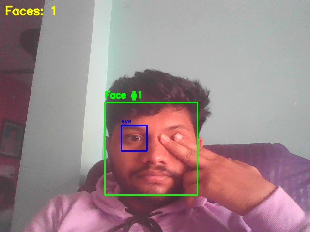
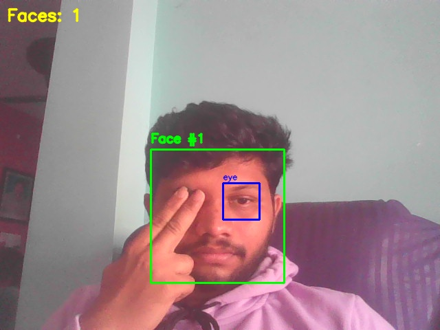
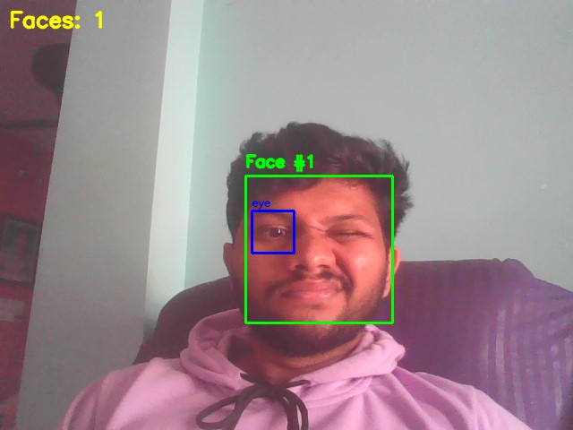
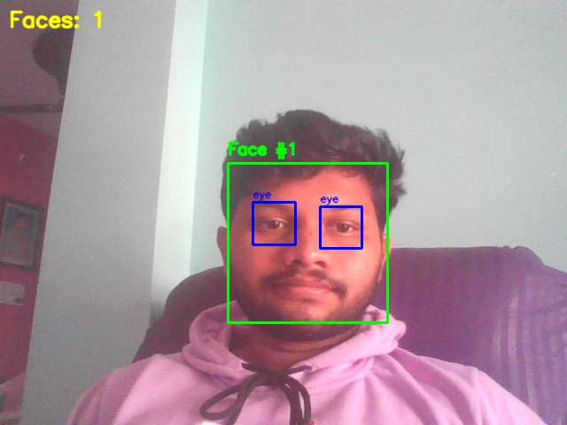

# 👁️ OpenCV Face + Eye Detection (Haar, Webcam)

This mini-project is part of my **computer vision fundamentals** series.

It uses **OpenCV Haar cascades** to perform **real-time face and eye detection** from a webcam stream, drawing bounding boxes and labels around each detected face and its eyes.

---

## 🎯 What this repo demonstrates

- Using **pretrained Haar cascade models** for detection
- Converting webcam frames to **grayscale** for classic CV algorithms
- Detecting **faces** in the full frame
- Detecting **eyes only inside the face ROI**
- Drawing bounding boxes and labels:
  - Green = face
  - Blue = eyes
- Live summary text: `Faces: N`
- Saving annotated frames with a key press

---

## 📂 Project Structure

```text
opencv-face-eye-detection-haar/
│
├── main.py                    # Webcam-based face + eye detection
├── requirements.txt           # Dependencies (opencv-python)
│
├── haar/                      # Haar cascade models
│   ├── haarcascade_frontalface_default.xml
│   └── haarcascade_eye.xml
│
└── outputs/                   # Saved snapshots from webcam

# 👤 Face & Eye Detection — OpenCV Haar Cascades (Webcam)

This project implements **real-time face + eye detection** using classic OpenCV **Haar Cascades**.  
It processes webcam video, detects faces first, then detects eyes **only inside the face region** for higher accuracy.

---

## ⚙️ 1️⃣ Install Dependencies

```bash
pip install -r requirements.txt
```

## 📂 2️⃣ Make sure Haar Cascade Files Exist

Make sure the Haar cascade files exist:

```text
haar/haarcascade_frontalface_default.xml
haar/haarcascade_eye.xml
```

You can download them from the official OpenCV GitHub repository under data/haarcascades.

---

## 📂 3️⃣ Run the Script

```bash
python main.py
```

---

## 📂 4️⃣ Controls

- `q` → quit
- `s` → save annotated snapshot into `outputs/`

---

# 🔍 How the Detection Pipeline Works (Explained Clearly)

## 1️⃣ Capture webcam frame (BGR)
- OpenCV reads frames in BGR format.

## 2️⃣ Convert to Grayscale

Haar cascades operate on grayscale because they use edge + intensity-based features.
- gray = cv2.cvtColor(frame, cv2.COLOR_BGR2GRAY)

## 3️⃣ Detect Faces (Haar Cascade)
Sliding-window + Haar-like features + AdaBoost.
- faces = face_cascade.detectMultiScale(gray, scaleFactor, minNeighbors)
Each detected face:
- gets a green box
- ROI extracted for more precise eye detection

## 4️⃣ Detect Eyes inside the face ROI
This reduces false positives significantly.
eyes = eye_cascade.detectMultiScale(roi_gray)
Eyes receive blue boxes.

## 5️⃣ Display results in real time
Frames update continuously with bounding boxes over detected faces and eyes.

---

## 🧠 Why This Project Matters for Real Vision Systems

Even though Haar cascades are old, they are still used because they are:

- ⚡ **Extremely fast**
- 🪶 **Lightweight (runs without GPU)**
- 🧪 **Great for quick prototypes**
- 🤖 **Useful on low-power robots / IoT systems**

This project helps you build solid intuition about:

✔ Sliding-window detectors  
✔ Haar-like feature extraction  
✔ Multi-stage detection (face → eyes)  
✔ How classical CV worked before deep learning  

It builds the mental bridge between:

➡️ **OpenCV image filters**  
➡️ **Classical CV detectors (Haar Cascades)**  
➡️ **Modern deep-learning detectors (YOLO, SSD, FaceNet, RetinaFace)**  

---

## 📸 Output Preview (Replace with your own images)

### Live Detection (Annotated)



### Face ROI Detection


### Eye Detection Inside Face


---

## 📁 Folder Structure

```text
face-eye-detection/
│
├── haar/
│ ├── haarcascade_frontalface_default.xml
│ └── haarcascade_eye.xml
│
├── outputs/
│ └── (saved snapshots go here)
│
├── main.py
└── README.md
```

---

## 🏁 Final Takeaway

By completing this project, you now understand the **classic real-time face + eye detection pipeline**:

- Haar cascades  
- Sliding-window scanning  
- Grayscale preprocessing  
- ROI-based hierarchical detection  
- Annotated video output  

This knowledge is the **foundation** before moving to deep-learning–based vision systems like **YOLOv8, SSD, RetinaFace, or MediaPipe**.

---
